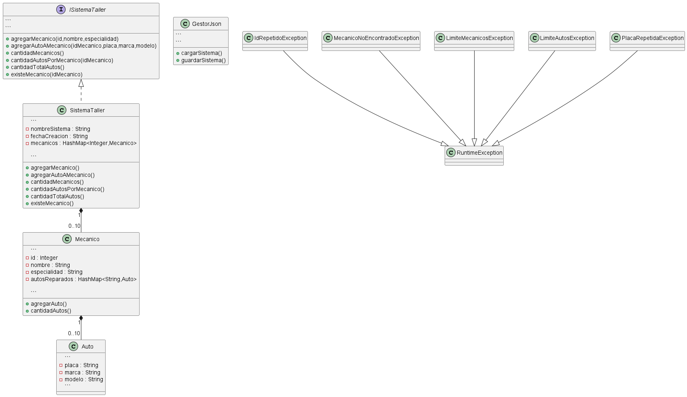

# Sistema de Administración de Mecánicos y Autos

Trabajo práctico final de Programación II.

## Descripción

Este proyecto implementa un sistema para la administración de mecánicos y los autos que reparan en un taller mecánico.

El sistema permite:

* Registrar hasta 10 mecánicos.
* Registrar hasta 10 autos reparados por cada mecánico.
* Asociar autos a un mecánico existente.
* Obtener la cantidad de autos reparados por un mecánico.
* Obtener la cantidad total de autos reparados por todos los mecánicos.
* Manejar errores mediante excepciones personalizadas.
* Guardar la información en archivos JSON.
* Recuperar la información desde archivos JSON.
* Verificar el correcto funcionamiento mediante pruebas unitarias.

---

## Estructura del Proyecto

```
SistemaTaller
│
├── src
│   ├── app
│   ├── interfaces
│   ├── modelo
│   ├── excepciones
│   ├── persistencia
│   └── test
│
├── lib
├── uml
├── datos.json
└── README.md
```

---

## Clases Principales

### SistemaTaller

Clase principal encargada de administrar los mecánicos registrados.

### Mecanico

Representa un mecánico del taller y los autos que tiene asignados.

### Auto

Representa un automóvil reparado por un mecánico.

### GestorJson

Permite guardar y recuperar la información utilizando archivos JSON.

---

## Excepciones Personalizadas

* IdRepetidoException
* MecanicoNoEncontradoException
* LimiteMecanicosException
* LimiteAutosException
* PlacaRepetidaException

---

## Persistencia

La información del sistema se almacena utilizando archivos JSON mediante la librería Gson.

Se implementan los métodos:

* cargarSistema()
* guardarSistema()

---

## Pruebas Unitarias

Se desarrollaron pruebas unitarias con JUnit para verificar:

* Cantidad de mecánicos.
* Existencia de mecánicos.
* Cantidad de autos por mecánico.
* Cantidad total de autos.
* Manejo de excepciones.
* Límites máximos establecidos por la consigna.

---

## Diagrama UML



---

## Tecnologías Utilizadas

* Java
* HashMap
* Gson
* JUnit
* PlantUML

---

## Autor

Trabajo práctico realizado para la materia Programación II.

